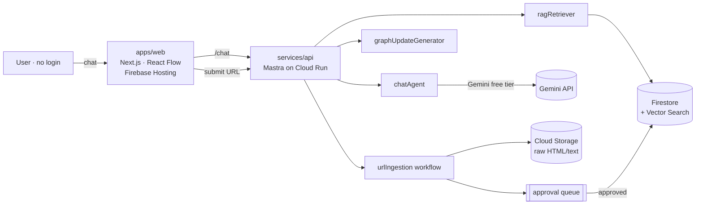

# WHV Compass

> Australia Working Holiday, navigated by AI — grounded in **official sources**, enriched by **real experiences**.
>
> オーストラリアのワーキングホリデーを、AI と一緒に計画する。**公式情報を土台**に、**実体験**で補強する集合知エージェント。

[](./LICENSE)
[](https://github.com/tori-create-7991/whv-compass/actions/workflows/ci.yml)
[-D97706.svg)](./docs/roadmap.md)

WHV Compass is an **open-source, login-less AI consultation service** for people
doing (or planning) a Working Holiday in Australia. You ask a question in plain
language; the AI answers **and** a live knowledge graph on the right updates
itself — turning a messy decision ("which city? which farm? how much money?")
into a structured, sourced plan.

> [!IMPORTANT]
> WHV Compass is **not** an official government service and does **not** provide
> legal, immigration, financial, or medical advice. Always verify against
> primary sources (Department of Home Affairs, Fair Work Ombudsman, ATO,
> Workforce Australia). **Do not enter personal/sensitive information.**

## What makes it different

- **Official-first sourcing.** Government/official pages are the factual base.
  Reviews, forums, and social posts are treated as *experience and signal*, never
  as fact — and every answer shows its **sources + trust level**.
- **Chat that draws.** Each AI answer returns a `graph_update` payload that adds
  / highlights nodes (goal, condition, candidate, risk, next action, source) on a
  [React Flow](https://reactflow.dev) canvas. See [`docs/data-model.md`](./docs/data-model.md).
- **Community ingestion, moderated.** Anyone can submit a URL they want indexed.
  It is crawled → AI-summarized/classified → **human approval queue** → only then
  added to RAG. No login, but abuse-protected (Cloudflare Turnstile + rate limits).
- **Cheap to run.** Stage 1 fits inside free/low tiers: Firebase Hosting +
  Cloud Run (scale-to-zero) + Firestore + Gemini free tier.

## Architecture (Stage 1 / MVP)



Full write-up: [`docs/architecture.md`](./docs/architecture.md) ·
3-stage roadmap (MVP → cost-efficient → accuracy): [`docs/roadmap.md`](./docs/roadmap.md).

## Monorepo layout

```
whv-compass/
├── apps/web          # Next.js front-end (chat + React Flow graph) → Firebase Hosting
├── services/api      # Mastra agents/workflows → Cloud Run
├── packages/shared   # Zod schemas + types: the graph_update / source / chat contracts
├── docs              # Architecture, data model, RAG, moderation, design system, ADRs
├── infra             # Deploy notes (Firebase / gcloud / Terraform pointers)
├── firebase.json     # Hosting + emulator config
├── firestore.rules   # Login-less but locked-down security rules
└── firestore.indexes.json
```

## Prerequisites

- Node.js: `>=20` (see `engines` in package.json)
- pnpm: `9.12.0` (see `packageManager` in package.json)

## Quick start

> A Gemini API key (free tier) for live
> answers; everything else runs against the Firebase emulator locally.

```bash
pnpm install
cp .env.example .env                 # fill GEMINI/GOOGLE key; leave the rest as-is for local
pnpm dev                             # runs web (3000) + api (8080) together via Turborepo
```

Then open http://localhost:3000. Without a key, the API returns a **mocked**
answer + `graph_update` so the UI is still fully explorable.

Per-package details: [`apps/web/README.md`](./apps/web/README.md) ·
[`services/api/README.md`](./services/api/README.md).

## Tech stack

| Layer    | Choice |
|----------|--------|
| Frontend | Next.js (App Router) · React · [@xyflow/react](https://reactflow.dev) · Tailwind CSS |
| Design   | **Terracotta** editorial aesthetic (warm cream + clay accent) — [`docs/design-system.md`](./docs/design-system.md) |
| Backend  | [Mastra](https://mastra.ai) agents/workflows on Cloud Run |
| LLM      | Google Gemini (free tier for MVP) via the AI SDK |
| Data     | Firestore (+ Vector Search) · Cloud Storage |
| Hosting  | Firebase Hosting (web) · Cloud Run (api) |
| Tooling  | pnpm workspaces · Turborepo · TypeScript · ESLint · Vitest |

## Contributing

Issues and PRs are welcome — especially **source submissions** (official pages
we should index) and **content review**. Please read
[`CONTRIBUTING.md`](./CONTRIBUTING.md) and our
[`CODE_OF_CONDUCT.md`](./CODE_OF_CONDUCT.md) first. Security reports:
[`SECURITY.md`](./SECURITY.md).

## License

[MIT](./LICENSE) © WHV Compass contributors. WHV Compass is an independent
community project and is not affiliated with the Australian Government or any
official body.
