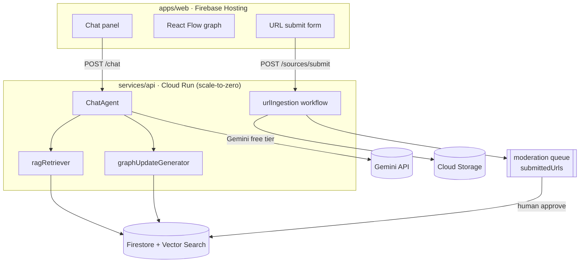

# Architecture

WHV Compass is a **login-less, official-source-grounded AI consultation service**
for Australia Working Holiday makers. A user asks a question; the system returns a
natural-language answer **and** a `graph_update` payload that mutates a live
knowledge graph on screen.

This document describes **Stage 1 (MVP)**. The cost-efficient and accuracy stages
are in [`roadmap.md`](./roadmap.md).

## System overview

### Request flow: a question

1. `apps/web` sends `{ sessionId, message, turnstileToken }` to `POST /chat`.
2. The API verifies Turnstile + rate limit, loads recent session messages.
3. `ragRetriever` fetches top-K chunks from Firestore (official chunks ranked
   above experience chunks — see [`rag.md`](./rag.md)).
4. `chatAgent` (Gemini) produces a **structured answer** using the fixed template:
   *結論 / あなたの条件 / 公式情報 / 体験談・集合知 / 注意点 / 次にやること / 出典*.
5. `graphUpdateGenerator` converts the answer into a `graph_update` JSON
   (add/highlight nodes + edges with provenance). Contract in
   [`data-model.md`](./data-model.md).
6. The API persists messages + graph deltas to Firestore and returns
   `{ answer, sources[], graph_update }`.
7. `apps/web` renders the answer and applies `graph_update` to the React Flow
   canvas (new nodes animate in, referenced nodes highlight).

### Request flow: a submitted URL

`submit → Turnstile check → store as submittedUrls{status:"pending"} → crawl
(Cloud Storage raw + extracted text) → AI classify/summarize/risk-score →
moderation queue → on human approve, chunk + embed → ragChunks`. The submitter
never writes to RAG directly. Details: [`moderation-and-privacy.md`](./moderation-and-privacy.md).

## Components

| Component | Path | Responsibility |
|-----------|------|----------------|
| Web app | `apps/web` | Chat UI, React Flow graph, URL submit form, disclaimers. Terracotta design system. |
| API | `services/api` | Mastra agents/workflows behind a small HTTP server. Owns Gemini + Firestore access. |
| Shared contracts | `packages/shared` | Zod schemas/types: `graph_update`, `Source`, `ChatMessage`, `SourceSubmission`. Single source of truth. |
| Data | Firestore + Cloud Storage | Sessions, messages, graph, sources, RAG chunks; raw/extracted crawl artifacts. |

### Why this split

- **Web ↔ API boundary** keeps secrets (Gemini key, admin Firestore) server-side
  only; the browser holds no credentials. The web app may also proxy through a
  thin Next.js route handler (`app/api/chat`) for same-origin calls.
- **Mastra on Cloud Run** gives an agent/workflow runtime that scales to zero
  (no idle cost) and is portable off GCP later.
- **Firestore-first** covers login-less sessions, realtime graph updates, the
  moderation queue, *and* (via Vector Search) MVP RAG — one datastore for Stage 1.

## Key design principles

1. **Sources are first-class.** Every fact-bearing answer carries `sources[]` with
   a `trustLevel`; the UI must show provenance. Official > media > community > sns.
2. **The graph is derived, not authored.** `graph_update` is produced by the model
   from the answer; the client never invents graph state.
3. **Pluggable RAG.** `ragRetriever` is an interface; Stage 1 uses Firestore
   Vector Search / a static JSON index, swappable for Vertex AI Vector Search or
   pgvector without touching agents. See [`rag.md`](./rag.md).
4. **Cost guardrails are code, not hope.** `min-instances=0`, top-K caps, answer
   token caps, conversation summarization, and submitted-URL dedup are explicit.
5. **Safe by default for a public, login-less, OSS app.** Turnstile, rate limits,
   locked Firestore rules, no PII, moderation before indexing, visible disclaimer.

## Environments

- **Local:** Firebase emulator (Firestore) + the API on `:8080` + web on `:3000`.
  No GCP project needed; missing Gemini key → mocked answers.
- **Prod (Stage 1):** Firebase Hosting (web), Cloud Run (api), Firestore + Vector
  Search, Cloud Storage, Secret Manager for keys. Domain: `aus.tori-dev.com`
  (subdomain) is the working target.
