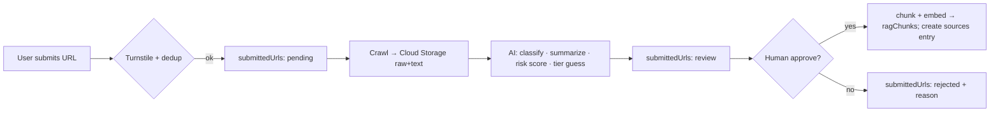

# Moderation, safety & privacy

WHV Compass is **public, login-less, and open source**. That combination demands
explicit guardrails so the system can't be turned into a spam/abuse vector or
leak personal data.

## Login-less abuse protection

| Risk | Control |
|------|---------|
| Automated question spam / cost blowup | Cloudflare **Turnstile** on chat + submit; `RATE_LIMIT_QUESTIONS_PER_HOUR` per session/IP; answer token cap. |
| Malicious URL submissions (SSRF, malware, junk) | Crawl in an isolated worker; allow-list schemes/ports; size limits; never fetch internal/metadata IPs. |
| Prompt injection from crawled/submitted content | Treat retrieved text as **data, not instructions**; system prompt isolates sources; no tool execution from source text. |
| Stored XSS via rendered content | Sanitize/escape all third-party text in the UI; render summaries, not raw HTML. |

## URL submission → approval pipeline

A submitter **never** writes to `ragChunks` or `sources` directly — only the
moderation step (privileged) does, after human approval.

## Content & copyright stance

- Store **summaries, short quotes, metadata, original URL, trust level, and a
  removal-check state** — not full copies of third-party articles or social posts.
- Honor `robots.txt` and site terms; back off on disallowed paths.
- Social platforms (X / Threads / Bluesky): prefer **user-submitted URLs** over
  broad scraping. Bluesky's API is the most permissive for experiments; X/Threads
  broad collection is deferred due to cost/ToS risk.

## Personal data / privacy

- The product **must not request** personal/sensitive data and the UI actively
  warns against entering it (passport, visa numbers, TFN, addresses).
- Sessions are anonymous (random id); no accounts, no email.
- `sessions.summary` stores a topic-level summary, not raw transcripts beyond
  what's needed for context; define a retention window before launch.

## Required user-facing disclaimers

Shown persistently in the UI (see `apps/web/components/Disclaimer.tsx`):

> ⚠️ 一般情報のみ・公式ではありません。法務/移民/税務/医療の助言ではありません。
> 必ず公式情報（Home Affairs / Fair Work / ATO 等）で確認してください。
> 個人情報・機微情報は入力しないでください。

## Cost guardrails (operational safety)

`min-instances=0`, top-K cap, answer token cap, conversation summarization, query
caching, and submitted-URL dedup. A monthly budget alert + a hard kill-switch env
(`READ_ONLY=true`) that disables LLM calls if a threshold is hit.
